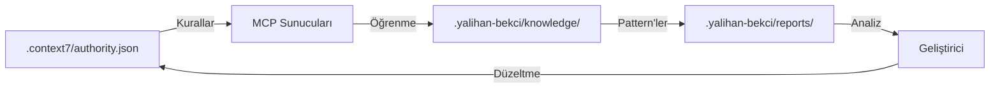

# 📊 .context7 ve .yalihan-bekci Klasör Analiz Raporu

**Tarih:** 30 Kasım 2025  
**Analiz Edilen Klasörler:** `.context7/` ve `.yalihan-bekci/`  
**Durum:** ✅ Detaylı İnceleme Tamamlandı

---

## 📋 Genel Özet

### `.context7/` Klasörü
- **Toplam Dosya:** 32 dosya
- **Alt Klasörler:** 3 (archive, cache, standards)
- **Ana Dosya:** `authority.json` (123,762 bytes - ~124 KB)
- **Versiyon:** 5.4.0
- **Durum:** ✅ Aktif ve Güncel

### `.yalihan-bekci/` Klasörü
- **Toplam Dosya:** 85 dosya (ana dizinde)
- **Alt Klasörler:** 7 (analysis, archive, completed, knowledge, learned, reports, tools)
- **Ana Dosya:** `README.md` (8,041 bytes)
- **Durum:** ✅ Aktif ve Organize

---

## 🔍 .context7 Klasörü Detaylı Analizi

### 📂 Klasör Yapısı

```
.context7/
├── 📄 authority.json (123 KB)          ⭐ TEK YETKİLİ KAYNAK
├── 📄 README.md (7.7 KB)               📚 Ana dokümantasyon
├── 📄 progress.json (2 KB)             📊 İlerleme takibi
├── 📄 mcp-config.json (3.6 KB)         🤖 MCP konfigürasyonu
│
├── 📋 STANDART DOSYALAR (25 dosya)
│   ├── FORBIDDEN_PATTERNS.md           ⭐ Yasak pattern'ler
│   ├── FORM_DESIGN_STANDARDS.md        📝 Form standartları
│   ├── TAILWIND-TRANSITION-RULE.md     🎨 CSS kuralları
│   ├── MIGRATION_STANDARDS.md          🗄️ Migration standartları
│   ├── STANDARDIZATION_STANDARDS.md    📐 Genel standartlar
│   ├── HARITA_SISTEMI_STANDARDS.md     🗺️ Harita sistemi
│   ├── ENABLED_FIELD_FORBIDDEN.md      🚫 Enabled field yasağı
│   ├── ORDER_DISPLAY_ORDER_STANDARD.md 🔢 Order standardı
│   ├── STATUS_COLUMN_GLOBAL_STANDARD.md ✅ Status standardı
│   ├── LOCATION_MAHALLE_ID_STANDARD.md 📍 Lokasyon standardı
│   └── ... (15 dosya daha)
│
├── 📁 standards/ (5 dosya)
│   ├── ENABLED_FIELD_FORBIDDEN.md      Detaylı enabled yasağı
│   ├── ORDER_DISPLAY_ORDER_STANDARD.md Detaylı order standardı
│   ├── ROUTE_NAMING_STANDARD.md        Route isimlendirme
│   ├── LOCATION_MAHALLE_ID_STANDARD.md Lokasyon detayları
│   └── CURSOR_MCP_SETUP.md             MCP kurulum
│
├── 📁 archive/                         Arşivlenmiş dosyalar
└── 📁 cache/                           Önbellek dosyaları
```

### ⭐ Kritik Dosyalar

#### 1. `authority.json` (123,762 bytes)
**En önemli dosya - TEK YETKİLİ KAYNAK**

- **Versiyon:** 5.4.0
- **Standart:** C7-PERMANENT-STANDARDS-2025-11-07
- **İçerik:**
  - Forbidden patterns (yasak desenler)
  - Required patterns (zorunlu desenler)
  - Database field naming standards
  - CSS framework standards (Tailwind CSS ONLY)
  - Route naming standards
  - Migration standards
  - API structure definitions
  - Form validation rules

**Kullanım:**
- Tüm IDE'ler bu dosyayı referans alır
- AI araçları bu dosyadan kuralları öğrenir
- Otomatik script'ler bu dosyayı kontrol eder
- MCP sunucuları bu dosyayı yükler

#### 2. Standart Dokümantasyon Dosyaları

**Öncelik Sırası:**

| Dosya | Boyut | Öncelik | Açıklama |
|-------|-------|---------|----------|
| `FORBIDDEN_PATTERNS.md` | 4 KB | ⭐⭐⭐⭐⭐ | Tüm yasak pattern'ler |
| `FORM_DESIGN_STANDARDS.md` | 12.7 KB | ⭐⭐⭐⭐⭐ | Form tasarım kuralları |
| `TAILWIND-TRANSITION-RULE.md` | 7.9 KB | ⭐⭐⭐⭐⭐ | CSS transition zorunluluğu |
| `MIGRATION_STANDARDS.md` | 14.6 KB | ⭐⭐⭐⭐ | Migration kuralları |
| `STANDARDIZATION_STANDARDS.md` | 8.6 KB | ⭐⭐⭐⭐ | Genel standartlar |

### 🚫 Yasak Desenler Özeti

**Database Fields:**
- ❌ `enabled`, `aktif`, `durum` → ✅ `status`
- ❌ `order` → ✅ `display_order`
- ❌ `sehir_id` → ✅ `il_id`
- ❌ `semt_id` → ✅ `mahalle_id`
- ❌ `musteri_id` → ✅ `kisi_id`
- ❌ `musteri_segmenti` → ✅ `kisi_segmenti`

**CSS Frameworks:**
- ❌ `neo-*` sınıfları (Neo Design System)
- ❌ `btn-*`, `card-*` (Bootstrap)
- ❌ Inline styles (sadece color-scheme için izinli)
- ✅ Pure Tailwind CSS ZORUNLU

**Routes:**
- ❌ `crm.*` prefix
- ❌ Double prefix (örn: `admin.admin.*`)
- ✅ `admin.*` single prefix

---

## 🔍 .yalihan-bekci Klasörü Detaylı Analizi

### 📂 Klasör Yapısı

```
.yalihan-bekci/
├── 📄 README.md (8 KB)                 📚 Ana dokümantasyon
│
├── 📋 GÜNLÜK RAPORLAR (85 dosya)
│   ├── BUGUN_TAMAMLANAN_ISLER_*.md    ✅ Günlük tamamlananlar
│   ├── CODE_DUPLICATION_*.md          🔄 Kod tekrarı analizleri
│   ├── DEAD_CODE_*.md                 🗑️ Dead code temizliği
│   ├── PERFORMANCE_*.md               ⚡ Performance iyileştirmeleri
│   ├── SECURITY_*.md                  🔒 Güvenlik düzeltmeleri
│   ├── REFACTORING_*.md               🔧 Refactoring işlemleri
│   └── ... (79 dosya daha)
│
├── 📁 knowledge/ (72 dosya)
│   ├── Pattern'ler ve öğrenilen bilgiler
│   ├── Context7 compliance pattern'leri
│   ├── Database schema pattern'leri
│   ├── CSS/Tailwind migration pattern'leri
│   ├── API entegrasyon pattern'leri
│   └── Code quality pattern'leri
│
├── 📁 reports/ (94 dosya)
│   ├── comprehensive-code-check-*.json  Kod kontrol raporları
│   ├── dead-code-analysis-*.json        Dead code analizleri
│   ├── mcp-guncelleme-raporu-*.md       MCP güncelleme raporları
│   └── ... (91 dosya daha)
│
├── 📁 completed/                       Tamamlanmış işlemler
│   ├── dead-code/                      Dead code temizliği
│   ├── test-coverage/                  Test coverage artırma
│   ├── performance/                    Performance iyileştirme
│   ├── code-duplication/               Code duplication refactoring
│   └── refactoring/                    Genel refactoring
│
├── 📁 analysis/                        Derinlemesine analizler
├── 📁 learned/                         Öğrenilen pattern'ler
├── 📁 tools/                           Yardımcı araçlar
└── 📁 archive/                         Arşivlenmiş raporlar
```

### 📊 İstatistikler

#### Knowledge Base (Bilgi Tabanı)
- **Toplam Dosya:** 72 dosya
- **Format:** JSON (52) + Markdown (20)
- **İçerik Türleri:**
  - Context7 compliance pattern'leri
  - Database schema pattern'leri
  - CSS/Tailwind migration pattern'leri
  - API entegrasyon pattern'leri
  - Code quality pattern'leri
  - Performance optimization pattern'leri

#### Reports (Raporlar)
- **Toplam Rapor:** 94 dosya
- **Türler:**
  - Comprehensive code check: 37 rapor
  - Dead code analysis: 30 rapor
  - MCP güncelleme raporları: 1 rapor
  - Diğer analizler: 26 rapor

#### Completed (Tamamlanmış İşlemler)
- **Dead Code Temizliği:** 9 dosya
- **Test Coverage:** 7 dosya
- **Performance:** 5 dosya
- **Code Duplication:** 3 dosya
- **Refactoring:** 7 dosya
- **Toplam:** 31 tamamlanmış işlem

### 🎯 Önemli Dosyalar

#### 1. `README.md`
- **Boyut:** 8,041 bytes
- **İçerik:** Yalıhan Bekçi sistemi dokümantasyonu
- **Bölümler:**
  - Amaç ve hedefler
  - Klasör yapısı
  - Organizasyon prensibi
  - Kullanım senaryoları
  - İstatistikler

#### 2. `FILTERABLE_TRAIT_USAGE.md`
- **Boyut:** 7,813 bytes
- **İçerik:** Filterable trait kullanım kılavuzu
- **Amaç:** Code duplication azaltma

#### 3. Knowledge Base Öne Çıkan Dosyalar
- `dead-code-cleanup-guide.md` (8.3 KB) - Dead code temizlik rehberi
- `git-commit-suggester-usage.md` (7.7 KB) - Git commit önerileri
- `css-architecture-standards.md` (5.3 KB) - CSS mimarisi
- `external-apis-documentation-2025-11-05.json` (26.5 KB) - API dokümantasyonu

---

## 🔄 İki Klasör Arasındaki İlişki

### Veri Akışı



### Rol Dağılımı

**`.context7/` - Standartlar ve Kurallar**
- ✅ Proje standartlarını tanımlar
- ✅ Yasak ve zorunlu pattern'leri belirler
- ✅ IDE ve AI araçları için referans
- ✅ Otomatik kontroller için kaynak

**`.yalihan-bekci/` - Öğrenme ve Takip**
- ✅ Yapılan işlemleri kaydeder
- ✅ Pattern'leri öğrenir
- ✅ Kod kalitesini analiz eder
- ✅ İyileştirme önerileri üretir

---

## 📈 Organizasyon Kalitesi

### ✅ Güçlü Yönler

1. **Merkezi Standart Yönetimi**
   - `authority.json` tek yetkili kaynak
   - Tüm standartlar bir yerde
   - Versiyon kontrolü mevcut

2. **Kapsamlı Dokümantasyon**
   - Her standart için ayrı dokümantasyon
   - Örneklerle açıklanmış
   - Öncelik seviyeleri belirlenmiş

3. **Sistematik Öğrenme**
   - Pattern'ler kaydediliyor
   - Raporlar düzenli oluşturuluyor
   - Bilgi tabanı sürekli güncelleniyor

4. **İyi Organize Edilmiş Arşiv**
   - Eski raporlar arşivleniyor
   - Tarihsel kayıt tutuluyor
   - Referans için erişilebilir

### ⚠️ İyileştirme Önerileri

1. **Dosya Sayısı Yönetimi**
   - `.yalihan-bekci/` ana dizininde 85 dosya var
   - Bazı dosyalar alt klasörlere taşınabilir
   - Benzer dosyalar birleştirilebilir

2. **Rapor Konsolidasyonu**
   - `reports/` klasöründe 94 dosya var
   - Eski raporlar daha agresif arşivlenebilir
   - Benzer raporlar birleştirilebilir

3. **Dokümantasyon Güncelliği**
   - Bazı dosyalar 11 Kasım 2025 tarihli
   - Güncel olmayan dosyalar işaretlenebilir
   - Aktif kullanılan dosyalar vurgulanabilir

---

## 🎯 Kullanım Önerileri

### Geliştiriciler İçin

1. **Yeni Kod Yazarken:**
   ```bash
   # Context7 kurallarını kontrol et
   cat .context7/authority.json | jq '.forbidden_patterns'
   
   # Yasak pattern'leri gör
   cat .context7/FORBIDDEN_PATTERNS.md
   ```

2. **Migration Oluştururken:**
   ```bash
   # Migration standartlarını oku
   cat .context7/MIGRATION_STANDARDS.md
   
   # Şablon standartlarını kontrol et
   cat .context7/MIGRATION_TEMPLATE_STANDARDS.md
   ```

3. **Form Tasarlarken:**
   ```bash
   # Form standartlarını oku
   cat .context7/FORM_DESIGN_STANDARDS.md
   ```

### AI Asistanları İçin

1. **MCP Sunucuları:**
   - `authority.json` otomatik yüklenir
   - Pattern'ler `.yalihan-bekci/knowledge/` den öğrenilir
   - Raporlar `.yalihan-bekci/reports/` e kaydedilir

2. **Öğrenme Sistemi:**
   - Her işlem kaydedilir
   - Pattern'ler çıkarılır
   - İyileştirme önerileri üretilir

---

## 📊 Özet Tablo

| Özellik | .context7 | .yalihan-bekci |
|---------|-----------|----------------|
| **Ana Amaç** | Standartlar ve kurallar | Öğrenme ve takip |
| **Dosya Sayısı** | 32 dosya | 85+ dosya |
| **Alt Klasör** | 3 klasör | 7 klasör |
| **Ana Dosya** | authority.json (124 KB) | README.md (8 KB) |
| **Güncelleme Sıklığı** | Düşük (standartlar) | Yüksek (günlük) |
| **Kullanım** | Referans | Analiz ve rapor |
| **Versiyon** | 5.4.0 | - |
| **Durum** | ✅ Stabil | ✅ Aktif |

---

## 🔗 İlgili Dosyalar

### Context7 İlgili
- `.context7/authority.json` - Ana otorite dosyası
- `.context7/README.md` - Context7 dokümantasyonu
- `.context7/FORBIDDEN_PATTERNS.md` - Yasak pattern'ler
- `antigravity_rules.md` - Antigravity kuralları

### Yalıhan Bekçi İlgili
- `.yalihan-bekci/README.md` - Yalıhan Bekçi dokümantasyonu
- `.yalihan-bekci/knowledge/` - Bilgi tabanı
- `.yalihan-bekci/reports/` - Analiz raporları
- `YALIHAN_BEKCI_EGITIM_DOKUMANI.md` - Eğitim dokümanı

### MCP İlgili
- `mcp-servers/README.md` - MCP sunucuları dokümantasyonu
- `mcp-servers/yalihan-bekci-mcp.js` - Yalıhan Bekçi MCP
- `mcp-servers/context7-validator-mcp.js` - Context7 Validator MCP
- `.context7/mcp-config.json` - MCP konfigürasyonu

---

**Analiz Tarihi:** 30 Kasım 2025  
**Analiz Eden:** Antigravity AI  
**Durum:** ✅ Detaylı İnceleme Tamamlandı

_Bu rapor, `.context7` ve `.yalihan-bekci` klasörlerinin kapsamlı analizini içermektedir. Her iki klasör de iyi organize edilmiş ve aktif olarak kullanılmaktadır._
