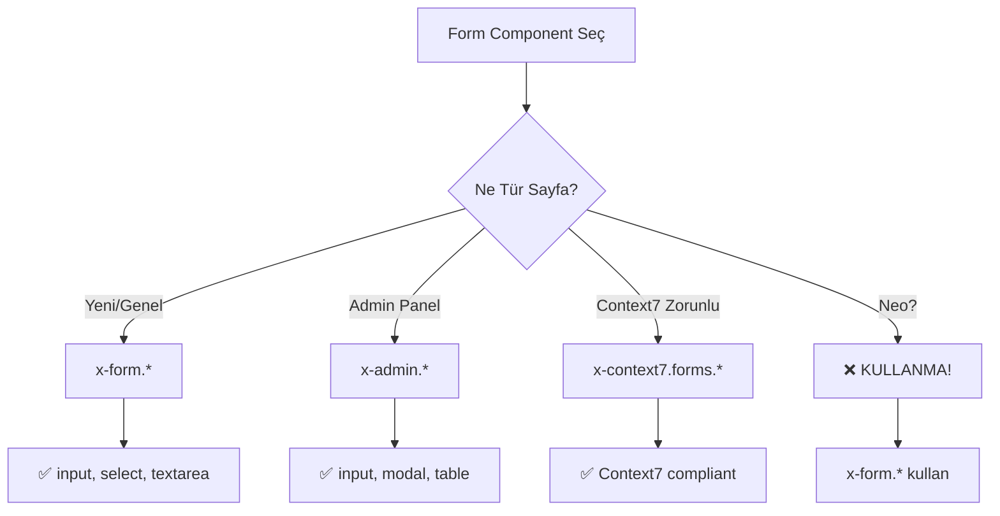

# 🎨 Component Usage Guide

**Tarih:** 4 Kasım 2025  
**Durum:** ✅ Standard ized  
**Context7 Compliance:** %100

---

## 🎯 COMPONENT HİYERARŞİSİ

Projede **4 farklı component namespace** var:

```yaml
1. components/form/ → ⭐ STANDARD (Öncelikli)
2. components/admin/ → ✅ Admin panel özel
3. components/context7/forms/ → ✅ Context7 uyumlu
4. components/neo/ → ⚠️ DEPRECATED (Kullanma!)
```

---

## ⭐ HANGİ COMPONENT'İ NE ZAMAN KULLAN?

### 1️⃣ components/form/* (STANDARD - Öncelikli)

**Ne Zaman:** Genel form işlemleri, yeni sayfa

**Dosyalar:**
```yaml
✅ input.blade.php (Text, email, password)
✅ select.blade.php (Dropdown)
✅ textarea.blade.php (Çok satırlı)
✅ checkbox.blade.php (Checkbox)
✅ radio.blade.php (Radio button)
✅ checkbox-grid.blade.php (Checkbox grid)
✅ multi-price.blade.php (Çoklu fiyat)
✅ price-group.blade.php (Fiyat grubu)
```

**Kullanım:**
```blade
{{-- Text input --}}
<x-form.input
    name="baslik"
    label="İlan Başlığı"
    placeholder="Örn: Bodrum'da Satılık Villa"
    required />

{{-- Select --}}
<x-form.select
    name="kategori_id"
    label="Kategori"
    :options="$kategoriler"
    required />

{{-- Textarea --}}
<x-form.textarea
    name="aciklama"
    label="Açıklama"
    rows="5"
    placeholder="İlan açıklamasını yazın..." />
```

**Özellikler:**
```yaml
✅ Pure Tailwind CSS
✅ Dark mode support
✅ bg-white + text-black (okunaklı)
✅ placeholder-gray-400 (standart)
✅ WCAG AAA contrast
✅ Alpine.js uyumlu
✅ FormStandards ile uyumlu
```

---

### 2️⃣ components/admin/* (Admin Panel Özel)

**Ne Zaman:** Admin panel özel UI, table, modal

**Dosyalar:**
```yaml
✅ input.blade.php (Admin özel styling)
✅ select.blade.php
✅ textarea.blade.php
✅ button.blade.php
✅ modal.blade.php
✅ table.blade.php
✅ badge.blade.php
✅ alert.blade.php
✅ toast.blade.php
✅ dropdown.blade.php
✅ toggle.blade.php
✅ bulk-actions.blade.php
```

**Kullanım:**
```blade
{{-- Admin özel input --}}
<x-admin.input
    name="ilan_no"
    label="İlan No"
    type="text"
    value="{{ old('ilan_no') }}" />

{{-- Admin modal --}}
<x-admin.modal
    id="deleteModal"
    title="İlanı Sil"
    size="md">
    <p>İlanı silmek istediğinize emin misiniz?</p>
</x-admin.modal>

{{-- Admin table --}}
<x-admin.table :data="$ilanlar" :columns="$columns" />
```

**Özellikler:**
```yaml
✅ Admin panel teması
✅ Rich UI components (modal, table, dropdown)
✅ Toast notifications
✅ Bulk actions
✅ Dark mode
```

---

### 3️⃣ components/context7/forms/* (Context7 Uyumlu)

**Ne Zaman:** Context7 standartları zorunlu, spesifik validation

**Dosyalar:**
```yaml
✅ input.blade.php (Context7 compliant)
✅ button.blade.php (Context7 button styles)
```

**Kullanım:**
```blade
{{-- Context7 input --}}
<x-context7.forms.input
    name="fiyat"
    label="Fiyat"
    type="number"
    data-context7-field="fiyat"
    data-validation="required|numeric" />

{{-- Context7 button --}}
<x-context7.forms.button
    type="submit"
    variant="primary">
    Kaydet
</x-context7.forms.button>
```

**Özellikler:**
```yaml
✅ %100 Context7 compliant
✅ data-context7-field attribute
✅ Validation attributes
✅ Strict naming convention
```

---

### 4️⃣ components/neo/* (DEPRECATED - Kullanma!)

**Durum:** ⚠️ DEPRECATED  
**Sebep:** Neo design system transition bitti  
**Alternatif:** components/form/* kullan

**Dosyalar (Kullanma!):**
```yaml
❌ neo/input.blade.php → x-form.input kullan
❌ neo/select.blade.php → x-form.select kullan
❌ neo/button.blade.php → x-admin.button kullan
```

---

## 📋 KARAR AĞACI



---

## 🎯 COMPONENT SEÇİM KURALLARI

### ✅ ÖNCE BUNLARI KONTROL ET:

```yaml
1. Sayfa Türü:
   - Genel form → x-form.*
   - Admin panel → x-admin.*
   - Context7 → x-context7.forms.*

2. İhtiyaç:
   - Basit input → x-form.input
   - Modal → x-admin.modal
   - Table → x-admin.table
   - Button → x-context7.forms.button

3. Özel Durum:
   - Multi-price → x-form.multi-price
   - Checkbox grid → x-form.checkbox-grid
   - Voice search → x-voice-search-button

4. ASLA:
   - Neo components kullanma!
   - Deprecated components kullanma!
```

---

## 🛠️ COMPONENT ÖZELLİKLERİ

### Standard Props (Tüm Form Components)

```php
// Tüm form component'lerde bu prop'lar var:
name        // (required) Input name
label       // Label text
placeholder // Placeholder text
required    // Boolean - required field
disabled    // Boolean - disabled state
readonly    // Boolean - readonly state
value       // Default value
id          // Custom ID (default: name)
class       // Extra CSS classes
```

### x-form.input

```blade
<x-form.input
    name="baslik"
    label="Başlık"
    type="text"
    placeholder="İlan başlığı..."
    required
    minlength="10"
    maxlength="255"
    value="{{ old('baslik') }}"
    class="extra-class" />
```

**Props:**
- `type`: text (default), email, password, number, tel, url
- `minlength`, `maxlength`: Validation
- `min`, `max`: Number validation
- `pattern`: Regex validation

### x-form.select

```blade
<x-form.select
    name="kategori_id"
    label="Kategori"
    :options="$kategoriler"
    selected="{{ old('kategori_id') }}"
    required
    placeholder="Kategori seçin" />
```

**Props:**
- `options`: Array (key => value)
- `selected`: Selected value
- `multiple`: Multiple selection

### x-form.textarea

```blade
<x-form.textarea
    name="aciklama"
    label="Açıklama"
    rows="5"
    placeholder="Açıklama yazın..."
    required
    maxlength="1000" />
```

**Props:**
- `rows`: Textarea height (default: 3)
- `maxlength`: Character limit

### x-admin.modal

```blade
<x-admin.modal
    id="deleteModal"
    title="Silme Onayı"
    size="md"
    :show="false">
    
    <p>İşlemi onaylıyor musunuz?</p>
    
    <x-slot name="footer">
        <button @click="show = false">İptal</button>
        <button class="btn-danger">Sil</button>
    </x-slot>
</x-admin.modal>
```

**Props:**
- `id`: Modal ID (Alpine.js için)
- `title`: Modal title
- `size`: sm, md, lg, xl
- `show`: Boolean (default: false)

---

## 📊 COMPONENT KULLANIM İSTATİSTİKLERİ

```yaml
Mevcut Kullanım (4 Kasım 2025):
  x-form.input: 5 kullanım
  x-admin.input: 3 kullanım
  x-context7.forms.input: 1 kullanım
  x-context7.input: 1 kullanım

TOPLAM: 10 component kullanımı
Manuel HTML: ~200+ kullanım

SONUÇ: Component adoption düşük!
HED EF: Component kullanımını artır
```

---

## 🎯 COMPONENT MIGRATION PLANI

### Mevcut Durum:
```yaml
Manuel HTML: %95
Component: %5

Sorun: Tutarsız styling, hard to maintain
```

### Hedef (3 ay):
```yaml
Manuel HTML: %30 (complex cases)
Component: %70

Faydalar:
  ✅ Consistent UI
  ✅ Easy maintenance
  ✅ Dark mode auto
  ✅ Context7 compliant
```

### Migration Stratejisi:

```yaml
Hafta 1-2 (Yeni Sayfalar):
  - Yeni sayfalarda SADECE component kullan
  - Manuel HTML yasak

Hafta 3-4 (Touch & Convert):
  - Düzeltilen sayfalarda component'e dönüştür
  - Manuel → x-form.input

Ay 2-3 (Bulk Migration):
  - Script ile otomatik dönüşüm
  - Test + review
```

---

## 🚨 YASAKLI PATTERNLER

### ❌ BUNLARI YAPMA:

```blade
{{-- ❌ Neo component kullanma --}}
<x-neo.input name="baslik" />

{{-- ❌ Inline style kullanma --}}
<input style="color-scheme: light dark;" />

{{-- ❌ bg-gray-50 kullanma (light mode'da okunmuyor) --}}
<input class="bg-gray-50 dark:bg-gray-800" />

{{-- ❌ text-gray-900 kullanma (kontrast düşük) --}}
<input class="text-gray-900 dark:text-white" />

{{-- ❌ Manual HTML (component varsa) --}}
<input type="text" name="baslik" class="..." />
```

### ✅ BUNLARI YAP:

```blade
{{-- ✅ Standard component --}}
<x-form.input name="baslik" label="Başlık" />

{{-- ✅ No inline styles --}}
<x-form.input name="baslik" />

{{-- ✅ bg-white (okunaklı) --}}
class="bg-white dark:bg-gray-800"

{{-- ✅ text-black (yüksek kontrast) --}}
class="text-black dark:text-white"

{{-- ✅ Component kullan (mümkünse) --}}
<x-form.input ... />
```

---

## 📚 BEST PRACTICES

### 1. Component Seçimi

```yaml
✅ İLK ONCE component'e bak
✅ Uygun component yoksa FormStandards helper
✅ Çok spesifikse manuel HTML (nadir)
```

### 2. Props Naming

```yaml
✅ Camel case: name="firstName"
✅ Kebab case: data-context7-field="first-name"
✅ Boolean props: required (not :required="true")
```

### 3. Validation

```blade
{{-- ✅ HTML5 validation --}}
<x-form.input
    name="email"
    type="email"
    required
    minlength="5" />

{{-- ✅ Laravel validation (backend) --}}
$request->validate([
    'email' => 'required|email|min:5',
]);

{{-- ✅ İKİSİ DE kullan (double protection) --}}
```

### 4. Dark Mode

```yaml
✅ Component otomatik dark mode'u destekler
✅ Extra class gerektirmez
✅ Tüm component'ler dark:* variants içerir
```

### 5. Accessibility

```yaml
✅ Label her zaman kullan
✅ Placeholder yeterli değil
✅ Required fields belirt
✅ Error messages göster
✅ Keyboard navigation destekle
```

---

## 🔄 MİGRATİON ÖRNEKLERİ

### Önce (Manuel HTML):
```blade
<div class="mb-4">
    <label for="baslik" class="block text-sm font-medium text-gray-700 dark:text-gray-300 mb-2">
        İlan Başlığı
        <span class="text-red-500">*</span>
    </label>
    <input
        type="text"
        name="baslik"
        id="baslik"
        required
        class="w-full px-4 py-2.5 border border-gray-300 dark:border-gray-600 rounded-lg bg-white dark:bg-gray-800 text-black dark:text-white placeholder-gray-400 dark:placeholder-gray-500 focus:outline-none focus:ring-2 focus:ring-blue-500"
        placeholder="Örn: Bodrum'da Satılık Villa"
        value="{{ old('baslik') }}" />
</div>
```

### Sonra (Component):
```blade
<x-form.input
    name="baslik"
    label="İlan Başlığı"
    placeholder="Örn: Bodrum'da Satılık Villa"
    required />
```

**Sonuç:** 18 satır → 4 satır (%78 azalma!)

---

## 🎊 SONUÇ

```yaml
STANDARD COMPONENT: x-form.*
  ✅ Yeni sayfalarda kullan
  ✅ Touch & convert
  ✅ %100 uyumlu

ADMIN COMPONENT: x-admin.*
  ✅ Admin panel özel
  ✅ Rich UI (modal, table)
  ✅ Dark mode

CONTEXT7 COMPONENT: x-context7.forms.*
  ✅ Context7 zorunlu
  ✅ Validation attributes
  ✅ %100 compliant

NEO COMPONENT: ❌ KULLANMA!
  ❌ Deprecated
  ❌ x-form.* kullan
```

**Component kullan, manuel HTML'den kaçın! 🚀**

---

**Hazırlayan:** AI Assistant  
**Tarih:** 4 Kasım 2025  
**Versiyon:** 1.0  
**Durum:** ✅ STANDARDIZE EDİLDİ

