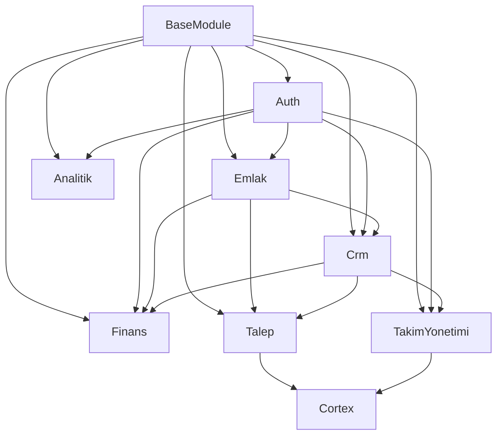

# 🔗 Modül Bağımlılıkları Haritası

**Tarih:** 01 Aralık 2025  
**Versiyon:** 1.0.0  
**Context7 Standardı:** C7-MODULE-DEPENDENCIES-2025-12-01

---

## 📋 Genel Bakış

Bu dokümantasyon, Yalıhan Emlak OS projesindeki modüller arası bağımlılıkları ve ilişkileri haritalar.

---

## 🗺️ Bağımlılık Haritası



---

## 📊 Modül Bağımlılıkları Detay

### 1. BaseModule

**Bağımlılıklar:** Yok (Temel modül)

**Kullanan Modüller:**
- ✅ Emlak
- ✅ Crm
- ✅ Finans
- ✅ TakimYonetimi
- ✅ Analitik
- ✅ Talep
- ✅ Auth

**Açıklama:** Tüm modüller için temel sınıfları sağlar (BaseController, BaseModel).

---

### 2. Auth Modülü

**Bağımlılıklar:**
- BaseModule

**Kullanan Modüller:**
- ✅ Emlak (User ilişkileri)
- ✅ Crm (User ilişkileri)
- ✅ Finans (User ilişkileri)
- ✅ TakimYonetimi (User ilişkileri)
- ✅ Analitik (User ilişkileri)

**Açıklama:** Kullanıcı kimlik doğrulama ve yetkilendirme. Tüm modüller User modelini kullanır.

---

### 3. Emlak Modülü

**Bağımlılıklar:**
- BaseModule
- Auth (User modeli)

**Kullanan Modüller:**
- ✅ Crm (İlan-Kişi ilişkileri)
- ✅ Talep (İlan-Talep eşleştirme)
- ✅ Finans (İlan-Komisyon ilişkileri)
- ✅ TakimYonetimi (İlan-Görev ilişkileri)

**Açıklama:** İlan yönetimi. Diğer modüller İlan modelini kullanır.

---

### 4. Crm Modülü

**Bağımlılıklar:**
- BaseModule
- Auth (User modeli)
- Emlak (Ilan modeli)

**Kullanan Modüller:**
- ✅ Talep (Kişi-Talep ilişkileri)
- ✅ Finans (Kişi-Finansal işlem ilişkileri)
- ✅ TakimYonetimi (Kişi-Görev ilişkileri)

**Açıklama:** Müşteri ilişkileri yönetimi. Kişi (Kisi) modeli diğer modüller tarafından kullanılır.

---

### 5. Finans Modülü

**Bağımlılıklar:**
- BaseModule
- Auth (User modeli)
- Emlak (Ilan modeli)
- Crm (Kisi modeli)

**Kullanan Modüller:**
- ✅ Analitik (Finansal istatistikler)

**Açıklama:** Finansal işlemler ve komisyon yönetimi.

---

### 6. TakimYonetimi Modülü

**Bağımlılıklar:**
- BaseModule
- Auth (User modeli)
- Crm (Kisi modeli)
- Emlak (Ilan modeli - opsiyonel)

**Kullanan Modüller:**
- ✅ Analitik (Görev istatistikleri)

**Açıklama:** Görev yönetimi ve takım koordinasyonu.

---

### 7. Talep Modülü

**Bağımlılıklar:**
- BaseModule
- Emlak (Ilan modeli)
- Crm (Kisi modeli)
- Cortex (SmartPropertyMatcherAI)

**Kullanan Modüller:**
- ✅ Analitik (Talep istatistikleri)

**Açıklama:** Müşteri talepleri ve AI destekli eşleştirme.

---

### 8. Analitik Modülü

**Bağımlılıklar:**
- BaseModule
- Emlak (İlan istatistikleri)
- Crm (Kişi istatistikleri)
- Finans (Finansal istatistikler)
- TakimYonetimi (Görev istatistikleri)
- Talep (Talep istatistikleri)

**Kullanan Modüller:** Yok (Son modül)

**Açıklama:** Dashboard'lar, istatistikler ve raporlar.

---

### 9. Cortex Modülü

**Bağımlılıklar:**
- BaseModule
- Talep (Talep modeli)
- Emlak (Ilan modeli)

**Kullanan Modüller:**
- ✅ TakimYonetimi (Telegram bot entegrasyonu)

**Açıklama:** AI destekli eşleştirme ve fırsat analizi.

---

## 🔄 Döngüsel Bağımlılıklar

**⚠️ Dikkat:** Aşağıdaki modüller arasında döngüsel bağımlılık yoktur. Tüm bağımlılıklar tek yönlüdür.

---

## 📦 Modül Yükleme Sırası

Modüller, `ModuleServiceProvider` içinde şu sırayla yüklenir:

1. **AuthServiceProvider** (Temel kimlik doğrulama)
2. **AdminServiceProvider** (Admin panel altyapısı)
3. **EmlakServiceProvider** (İlan yönetimi)
4. **CrmServiceProvider** (CRM sistemi)
5. **TakimYonetimiServiceProvider** (Takım yönetimi)
6. **AnalitikServiceProvider** (Analitik)
7. **FinansServiceProvider** (Finans)

**Not:** Bu sıralama, bağımlılık zincirine göre belirlenmiştir.

---

## 🚨 Kritik Bağımlılıklar

### Yüksek Öncelikli

1. **BaseModule → Tüm Modüller**
   - Tüm modüller BaseModule'a bağımlıdır
   - BaseModule değişiklikleri tüm modülleri etkiler

2. **Auth → Tüm Modüller**
   - Tüm modüller User modelini kullanır
   - Auth değişiklikleri tüm modülleri etkiler

3. **Emlak → Crm, Talep, Finans**
   - İlan modeli birçok modül tarafından kullanılır
   - Emlak değişiklikleri birçok modülü etkiler

### Orta Öncelikli

4. **Crm → Talep, Finans, TakimYonetimi**
   - Kişi modeli birçok modül tarafından kullanılır

5. **Cortex → Talep, TakimYonetimi**
   - AI eşleştirme sistemi kritik özellikler için kullanılır

---

## 🔧 Bağımlılık Yönetimi

### Best Practices

1. **Interface Kullanımı:** Modüller arası iletişim için interface'ler kullanılmalı
2. **Service Injection:** Bağımlılıklar constructor injection ile sağlanmalı
3. **Event-Driven:** Modüller arası iletişim için Laravel Events kullanılmalı
4. **Loose Coupling:** Modüller mümkün olduğunca gevşek bağlı olmalı

### Örnek: Service Injection

```php
// CrmServiceProvider.php
public function register()
{
    $this->app->singleton(KisiService::class, function ($app) {
        return new KisiService;
    });
}

// FinansServiceProvider.php
public function register()
{
    // KisiService'i inject edebiliriz
    $this->app->when(FinansService::class)
        ->needs(KisiService::class)
        ->give(function ($app) {
            return $app->make(KisiService::class);
        });
}
```

---

## 📝 Notlar

- **Modüler Yapı:** Her modül bağımsız çalışabilir, ancak diğer modüllerle entegre edilebilir
- **Context7 Uyumluluk:** Tüm modüller Context7 standartlarına uygundur
- **Test Edilebilirlik:** Bağımlılıklar mock'lanabilir şekilde tasarlanmıştır

---

**Son Güncelleme:** 01 Aralık 2025

