# 🔄 jQuery Migration Planı

**Tarih:** 1 Kasım 2025 - 23:15  
**Durum:** 📊 PLANLAMA  
**Hedef:** jQuery'yi %100 kaldırma  
**Tahmini Süre:** 4-5 saat

---

## 📊 MEVCUT DURUM

### **jQuery Kullanımı:**
```yaml
Total jQuery Calls: 32
Affected Files: 6
Bundle Size: +87 KB (CDN)
Context7 Status: ⚠️ VIOLATION
```

### **Dosya Detayları:**
```
1. public/js/admin/location-helper.js: 10 calls 🔴 EN ÖNEMLİ
2. public/js/address-select.js: 8 calls 🔴
3. public/js/modules/ilan-form.js: 6 calls 🟡
4. public/js/admin/location-map-helper.js: 5 calls 🟡
5. public/js/debug-address-selector.js: 2 calls 🟢
6. public/js/admin/csrf-handler.js: 1 call 🟢
```

### **Layout Dosyası:**
```blade
resources/views/admin/layouts/neo.blade.php:180-183
<!-- ⚠️ GEÇICI: jQuery - Migration tamamlanana kadar (2025-10-21) -->
<script src="https://code.jquery.com/jquery-3.7.1.min.js"></script>
```

---

## 🎯 MİGRATİON STRATEJİSİ

### **PHASE 1: Kolay Kazançlar (30 dk)**
**Hedef:** Basit dosyaları temizle

**Dosyalar:**
1. `csrf-handler.js` (1 call) - 5 dk
2. `debug-address-selector.js` (2 calls) - 10 dk

**Vanilla JS Alternatifler:**
```javascript
// jQuery → Vanilla JS
$.ajax({...}) → fetch()
$(selector) → document.querySelector()
$.ready() → DOMContentLoaded
```

**Beklenen:**
- ✅ -3 jQuery calls
- ✅ 2 dosya temizlendi
- ⏱️ 15 dakika

---

### **PHASE 2: Orta Seviye (1.5 saat)**
**Hedef:** ilan-form.js ve location-map-helper.js

**Dosyalar:**
1. `ilan-form.js` (6 calls) - 45 dk
2. `location-map-helper.js` (5 calls) - 45 dk

**jQuery Patterns:**
```javascript
// Form handling
$('form').submit() → form.addEventListener('submit')
$('input').val() → input.value
$('.class').hide() → element.style.display = 'none'

// AJAX
$.ajax() → fetch()
$.post() → fetch(url, {method: 'POST'})
```

**Beklenen:**
- ✅ -11 jQuery calls
- ✅ 2 dosya temizlendi
- ⏱️ 1.5 saat

---

### **PHASE 3: Kritik Dosyalar (2 saat)**
**Hedef:** location-helper.js ve address-select.js

**Dosyalar:**
1. `location-helper.js` (10 calls) 🔴 KRİTİK
2. `address-select.js` (8 calls) 🔴 KRİTİK

**Zorluklar:**
- ⚠️ Location API entegrasyonu
- ⚠️ Address cascade (il → ilçe → mahalle)
- ⚠️ Map integration
- ⚠️ AJAX chain calls

**Vanilla JS Stratejisi:**
```javascript
// Cascade select
async function loadDistricts(cityId) {
    const response = await fetch(`/api/districts/${cityId}`);
    const districts = await response.json();
    populateSelect(districtSelect, districts);
}

// Map helper
const map = L.map('map').setView([lat, lng], zoom);
// jQuery gerektirmez, native Leaflet kullan
```

**Beklenen:**
- ✅ -18 jQuery calls
- ✅ 2 dosya temizlendi
- ⏱️ 2 saat

---

### **PHASE 4: Testing & Cleanup (1 saat)**
**Hedef:** Tüm sistemi test et ve jQuery'yi kaldır

**Test Scenarios:**
```yaml
✅ İlan Create Form (ilan-form.js)
✅ İlan Edit Form (ilan-form.js)
✅ Address Selector (address-select.js)
✅ Location Picker (location-helper.js)
✅ Map Integration (location-map-helper.js)
✅ CSRF Token Handling (csrf-handler.js)
✅ Debug Tools (debug-address-selector.js)
```

**Final Cleanup:**
```blade
# resources/views/admin/layouts/neo.blade.php
# SATIRLARI SİL (180-187)
<script src="https://code.jquery.com/jquery-3.7.1.min.js"></script>
<script>
    console.log('⚠️ jQuery temporarily loaded - Migration in progress...');
</script>
```

**Beklenen:**
- ✅ -32 jQuery calls (TOTAL)
- ✅ -87 KB bundle size
- ✅ Context7 %100 ✨
- ⏱️ 1 saat

---

## 📅 TIMELINE

```mermaid
gantt
    title jQuery Migration Timeline
    dateFormat HH:mm
    section Phase 1
    csrf-handler.js         :a1, 00:00, 5m
    debug-address-selector  :a2, after a1, 10m
    
    section Phase 2
    ilan-form.js           :b1, after a2, 45m
    location-map-helper    :b2, after b1, 45m
    
    section Phase 3
    location-helper.js     :c1, after b2, 60m
    address-select.js      :c2, after c1, 60m
    
    section Phase 4
    Testing & Cleanup      :d1, after c2, 60m
```



**Total:** 4 saat 45 dakika

---

## 🔄 VANILLA JS PATTERNS

### **1. AJAX Calls:**
```javascript
// ❌ jQuery
$.ajax({
    url: '/api/endpoint',
    method: 'POST',
    data: {key: 'value'},
    success: function(response) {
        console.log(response);
    }
});

// ✅ Vanilla JS (Fetch API)
fetch('/api/endpoint', {
    method: 'POST',
    headers: {
        'Content-Type': 'application/json',
        'X-CSRF-TOKEN': document.querySelector('meta[name="csrf-token"]').content
    },
    body: JSON.stringify({key: 'value'})
})
.then(response => response.json())
.then(data => console.log(data))
.catch(error => console.error(error));
```

### **2. DOM Selection:**
```javascript
// ❌ jQuery
$('#element')
$('.class')
$('tag')

// ✅ Vanilla JS
document.getElementById('element')
document.querySelector('.class')
document.querySelectorAll('tag')
```

### **3. Event Listeners:**
```javascript
// ❌ jQuery
$('#button').click(function() {
    console.log('Clicked');
});

// ✅ Vanilla JS
document.getElementById('button').addEventListener('click', () => {
    console.log('Clicked');
});
```

### **4. Form Handling:**
```javascript
// ❌ jQuery
$('#form').submit(function(e) {
    e.preventDefault();
    const data = $(this).serialize();
});

// ✅ Vanilla JS
document.getElementById('form').addEventListener('submit', (e) => {
    e.preventDefault();
    const formData = new FormData(e.target);
    const data = Object.fromEntries(formData);
});
```

### **5. Show/Hide Elements:**
```javascript
// ❌ jQuery
$('.element').hide();
$('.element').show();

// ✅ Vanilla JS
document.querySelector('.element').style.display = 'none';
document.querySelector('.element').style.display = 'block';
```

---

## ✅ BAŞARI KRİTERLERİ

### **Migration Complete Checklist:**
```yaml
✅ All 6 files migrated to Vanilla JS
✅ 0 jQuery calls in codebase
✅ jQuery script removed from layout
✅ All features working (tested)
✅ Context7 compliance: %100
✅ Bundle size reduced (-87 KB)
✅ Console clean (no warnings)
✅ Browser compatibility (IE11+)
```

### **Testing Checklist:**
```yaml
✅ İlan Create → Form submit, address select
✅ İlan Edit → Form update, location picker
✅ Address Cascade → İl → İlçe → Mahalle
✅ Map Integration → Leaflet + markers
✅ CSRF Token → Automatic injection
✅ Error Handling → Fetch errors, network issues
```

---

## 🚀 QUICK START

### **Step 1: Backup**
```bash
# Git commit before migration
git add .
git commit -m "Pre jQuery migration backup"
```

### **Step 2: Start Migration**
```bash
# Phase 1 (30 dk)
vim public/js/admin/csrf-handler.js
vim public/js/debug-address-selector.js

# Test
npm run build
# Browser test

# Commit
git add .
git commit -m "jQuery migration: Phase 1 (csrf-handler, debug-address)"
```

### **Step 3: Continue...**
```bash
# Phase 2, 3, 4 devam et
# Her phase sonrası commit!
```

---

## 📊 PROGRESS TRACKING

| Phase | Files | jQuery Calls | Time | Status |
|-------|-------|--------------|------|--------|
| 1 | 2/6 | -3/32 | 15m | ⏳ TODO |
| 2 | 2/6 | -11/32 | 1.5h | ⏳ TODO |
| 3 | 2/6 | -18/32 | 2h | ⏳ TODO |
| 4 | - | - | 1h | ⏳ TODO |
| **TOTAL** | **6/6** | **-32/32** | **4.75h** | ⏳ **TODO** |

---

## ⚠️ RISK MİTİGATİON

### **Risk 1: Breaking Changes**
**Mitigation:**
- Git commit her phase sonrası
- Browser testing her dosyada
- Rollback planı hazır

### **Risk 2: Location API Issues**
**Mitigation:**
- Leaflet documentation review
- Fetch API error handling
- Network timeout handling

### **Risk 3: Time Overrun**
**Mitigation:**
- Phase-by-phase approach
- 30 dk buffer per phase
- Prioritize critical files

---

## 🎯 NEXT STEPS

### **HEMEN (15 dk):**
1. ✅ Console warning'i kaldır (satır 186)
2. ✅ Bu plan README'ye ekle
3. ✅ Commit: "jQuery migration plan created"

### **YARIN (4-5 saat):**
1. ⏳ Phase 1: csrf-handler + debug-address (30 dk)
2. ⏳ Phase 2: ilan-form + location-map (1.5h)
3. ⏳ Phase 3: location-helper + address-select (2h)
4. ⏳ Phase 4: Testing + cleanup (1h)

### **PAZARTESI (Test):**
1. ⏳ Production-like test
2. ⏳ Performance metrics
3. ⏳ Context7 validation
4. ⏳ Deploy to staging

---

**Oluşturulma:** 1 Kasım 2025 - 23:15  
**Son Güncelleme:** 1 Kasım 2025 - 23:15  
**Durum:** 📊 PLANLAMA

