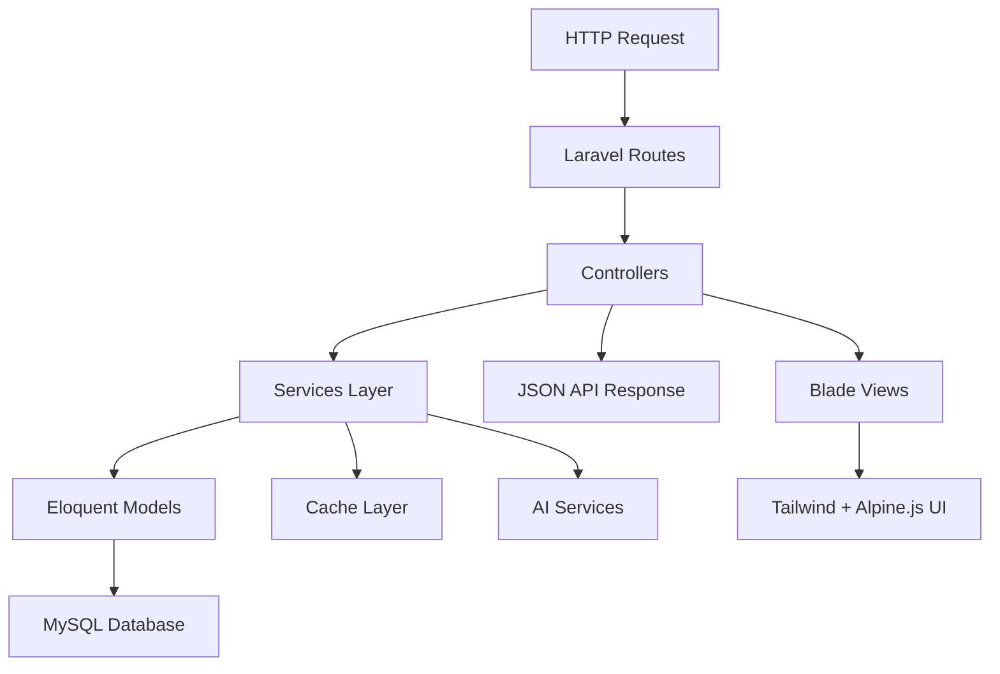

# 🏗️ YALIHAN EMLAK - PROJE YAPISI VE KOD MİMARİSİ

**Tarih:** 24 Kasım 2025  
**Versiyon:** EmlakPro v4.4.0  
**Mimari:** Laravel 10 + Hybrid Modular + Context7  
**Durum:** ✅ Aktif Production

---

## 📋 GENEL MİMARİ

### 🎯 Hybrid Architecture (İkili Mimari)

```yaml
STANDARD LARAVEL (Ana Sistem):
  Controllers: app/Http/Controllers/Admin/ (60 controller)
  Views: resources/views/admin/ (200+ view)
  Routes: routes/admin.php, routes/api.php
  
MODULAR LARAVEL (Ek Özellikler):
  Modules: app/Modules/* (14 modül, 122 dosya)
  Structure: Kendi routes, controllers, models
  Integration: ServiceProvider ile entegrasyon
  
TEKNOLOJİ STACK:
  Backend: Laravel 10.x + PHP 8.1+
  Frontend: Vite + Tailwind CSS + Alpine.js
  Database: MySQL 8.0+ + Redis Cache
  AI: Context7 Dual System + Multiple Providers
```

### 🔄 Veri Akışı



---

## 🗂️ PROJE KLASÖR YAPISI

### Backend (Laravel 10)

```
app/
├── Console/               # Artisan commands
│   ├── Commands/         # Custom commands
│   └── Kernel.php        # Command scheduling
├── Http/
│   ├── Controllers/
│   │   ├── Admin/        # Admin panel (60 controllers)
│   │   │   ├── IlanController.php
│   │   │   ├── KisiController.php
│   │   │   ├── DashboardController.php
│   │   │   └── ...
│   │   ├── Api/          # API controllers
│   │   │   ├── AIController.php
│   │   │   ├── LocationController.php
│   │   │   └── ...
│   │   ├── AI/           # AI-specific controllers
│   │   └── Frontend/     # Public controllers
│   ├── Middleware/       # Custom middleware
│   │   ├── Context7Middleware.php
│   │   ├── AIRateLimitMiddleware.php
│   │   └── ...
│   ├── Requests/         # Form validation
│   └── Resources/        # API resources
├── Models/               # Eloquent models (40+)
│   ├── Ilan.php
│   ├── Kisi.php
│   ├── Il.php
│   └── ...
├── Modules/              # Modular architecture (14 modules)
│   ├── Admin/
│   ├── Auth/
│   ├── Emlak/
│   ├── Talep/
│   ├── CRMSatis/
│   ├── Analitik/
│   ├── TakimYonetimi/
│   ├── ArsaModulu/
│   ├── Finans/
│   └── BaseModule/
├── Services/             # Business logic
│   ├── AI/
│   ├── Cache/
│   ├── Location/
│   └── ...
├── Observers/            # Model observers
├── Providers/            # Service providers
├── Traits/               # Reusable traits
└── Helpers/              # Helper functions
```

### Frontend Assets

```
resources/
├── css/
│   ├── app.css          # Main Tailwind CSS
│   └── leaflet.css      # Map styles
├── js/
│   ├── admin/           # Admin panel JS
│   │   ├── global.js
│   │   ├── ilan-create.js
│   │   ├── ai-settings/
│   │   └── services/
│   ├── components/      # Reusable JS components
│   │   ├── LocationManager.js
│   │   ├── UnifiedPersonSelector.js
│   │   └── ...
│   └── app.js          # Main JS entry point
├── views/
│   ├── admin/           # Admin panel views (200+)
│   │   ├── ilanlar/
│   │   ├── kisiler/
│   │   ├── dashboard/
│   │   └── layouts/
│   ├── components/      # Blade components
│   │   ├── neo-input.blade.php
│   │   ├── price-history-chart.blade.php
│   │   └── ...
│   └── frontend/        # Public views
└── lang/                # Localization files
```

### Configuration & Routes

```
config/
├── ai.php               # AI providers config
├── context7.php         # Context7 settings
├── elasticsearch.php    # Search configuration
└── ...

routes/
├── web.php              # Frontend routes
├── api.php              # API routes
├── admin.php            # Admin panel routes
├── ai.php               # AI endpoints
└── location.php         # Location services

database/
├── migrations/          # Database migrations
├── seeders/            # Database seeders
└── factories/          # Model factories
```

---

## 🛠️ TEKNOLOJİ STACK

### Backend Technologies

```yaml
Core Framework:
  - Laravel: 10.x
  - PHP: 8.1+
  - Composer: Dependency management

Database & Cache:
  - MySQL: 8.0+ (Primary database)
  - Redis: Cache & sessions
  - Elasticsearch: Search (optional)

Queue & Jobs:
  - Laravel Horizon: Queue management
  - Redis: Queue driver

Authentication:
  - Laravel Sanctum: API authentication
  - Laravel Breeze: Web authentication

Key Packages:
  - Spatie Laravel Permission: Role management
  - Laravel Telescope: Debugging
  - Intervention Image: Image processing
  - Guzzle HTTP: External API calls
```

### Frontend Technologies

```yaml
Build Tools:
  - Vite: Modern build tool
  - PostCSS: CSS processing
  - Autoprefixer: CSS vendor prefixes

CSS Framework:
  - Tailwind CSS: 3.4.18 (ZORUNLU)
  - Custom plugins: Extended functionality
  - Dark mode: Full support
  
JavaScript:
  - Alpine.js: 3.15.0 (Reactive UI - 15KB)
  - Vanilla JS: Custom logic
  - ES Modules: Modern JS structure

Maps & Charts:
  - Leaflet.js: 1.9.4 (Maps)
  - Chart.js: 4.4.0 (Charts)
  - OpenStreetMap: Tile provider

FORBIDDEN Technologies:
  - ❌ Bootstrap (Legacy)
  - ❌ Neo Design System (Deprecated)
  - ❌ jQuery (Legacy)
  - ❌ React/Vue (Too heavy for admin)
```

### AI & External Integrations

```yaml
AI Providers:
  - OpenAI: GPT models
  - Claude: Anthropic models
  - Gemini: Google models
  - DeepSeek: Alternative provider
  - Ollama: Local models

Context7 Systems:
  - Upstash Context7 MCP: Library documentation
  - Yalıhan Bekçi Context7: Project rules

External APIs:
  - TCMB: Currency rates
  - TKGM: Land registry
  - TurkiyeAPI: Location data
  - Nominatim: Geocoding

Workflow Automation:
  - n8n: Workflow automation
  - Docker: Service containerization
```

---

## 📦 MODÜLER YAPI (app/Modules/)

### Modül İstatistikleri

| # | Modül | Dosya | Import | Durum | Kullanım Alanı |
|---|-------|-------|--------|-------|----------------|
| 1 | **Admin** | 25 | 45 | ✅ Aktif | Admin panel yönetimi |
| 2 | **Auth** | 18 | 24 | ✅ Aktif | Kimlik doğrulama |
| 3 | **Emlak** | 28 | 32 | ✅ Aktif | İlan yönetimi |
| 4 | **Talep** | 8 | 4 | ⚠️ Düşük | Talep sistemi |
| 5 | **CRMSatis** | 15 | 28 | ✅ Aktif | CRM işlemleri |
| 6 | **Analitik** | 12 | 7 | ✅ Aktif | Analytics dashboard |
| 7 | **TakimYonetimi** | 18 | 24 | ✅ Aktif | Takım/görev yönetimi |
| 8 | **ArsaModulu** | 10 | 12 | ✅ Aktif | Arsa özel işlemleri |
| 9 | **Finans** | 8 | 15 | ✅ Aktif | Mali işlemler |
| 10 | **BaseModule** | 5 | - | ✅ Core | Temel modül servisi |

### Modül Mimarisi

```php
// Örnek Modül Yapısı: app/Modules/Emlak/
Emlak/
├── Controllers/
│   ├── EmlakController.php
│   └── IlanController.php
├── Models/
│   └── EmlakModel.php
├── Routes/
│   ├── web.php
│   └── api.php
├── Services/
│   └── EmlakService.php
├── Views/
│   └── emlak/
├── Migrations/
└── EmlakServiceProvider.php
```

---

## 🎨 CSS VE UI STANDARTLARI

### ZORUNLU Tailwind CSS Kuralları

#### ✅ DOĞRU Kullanım

```html
<!-- Button Example -->
<button class="px-4 py-2.5 bg-blue-600 text-white rounded-lg
               hover:bg-blue-700 hover:scale-105
               active:scale-95 
               focus:ring-2 focus:ring-blue-500
               transition-all duration-200 ease-in-out
               shadow-md hover:shadow-lg
               dark:bg-blue-700 dark:hover:bg-blue-800
               sm:px-6 sm:py-3">
    Kaydet
</button>

<!-- Input Example -->
<input class="w-full px-4 py-2.5 
              border border-gray-300 rounded-lg
              focus:ring-2 focus:ring-blue-500 focus:border-transparent
              transition-all duration-200
              dark:bg-gray-800 dark:border-gray-600 dark:text-white
              placeholder:text-gray-500 dark:placeholder:text-gray-400"
       placeholder="İlan başlığı...">

<!-- Card Example -->
<div class="bg-white dark:bg-gray-800 
           rounded-xl shadow-lg border border-gray-200 dark:border-gray-700
           p-6 transition-all duration-300 ease-in-out
           hover:shadow-xl hover:scale-[1.02]">
    Card content here
</div>
```

#### ❌ YASAK Kullanım

```html
<!-- NEO DESIGN SYSTEM - YASAK -->
<button class="neo-btn neo-btn-primary">Kaydet</button>
<div class="neo-card">Content</div>
<input class="neo-input">

<!-- BOOTSTRAP - YASAK -->
<button class="btn btn-primary">Kaydet</button>
<div class="card">Content</div>
<input class="form-control">
```

### Zorunlu Özellikler

```yaml
Transition/Animation:
  - Zorunlu: transition-all duration-200
  - Hover: hover:scale-105, hover:shadow-lg
  - Active: active:scale-95
  - Focus: focus:ring-2

Dark Mode:
  - Zorunlu: Her elemanda dark: variant
  - Background: dark:bg-gray-800
  - Text: dark:text-white
  - Border: dark:border-gray-700

Responsive:
  - Yaklaşım: Mobile-first
  - Breakpoints: sm:, md:, lg:, xl:, 2xl:
  - Grid: grid-cols-1 md:grid-cols-2 lg:grid-cols-3
```

---

## 🔄 CONTEXT7 SİSTEM ENTEGRASYONU

### Dual System Architecture

```yaml
1. UPSTASH CONTEXT7 MCP:
   Purpose: Library documentation
   Tools: resolve-library-id, get-library-docs
   Usage: Laravel/React/MySQL docs
   
2. YALIHAN BEKÇİ CONTEXT7:
   Purpose: Project rules & compliance  
   Tools: get_context7_rules, validate, check_pattern
   Usage: Project-specific standards
```

### Context7 Standartları

```yaml
Database Field Naming:
  ✅ Correct: status, display_order, mahalle_id, il_id
  ❌ Forbidden: durum, order, semt_id, sehir_id, is_active, aktif

API Response Format:
  Standard: {success: boolean, message: string, data: mixed}
  Error: {success: false, errors: array, code: string}
  
CSS Classes:
  ✅ Required: Tailwind utility classes
  ❌ Forbidden: neo-*, btn-*, card-*, form-control

Bundle Size Limits:
  Per page JS: < 50KB gzipped
  Vendor bundle: < 100KB gzipped
  Total bundle: < 150KB gzipped
  CSS bundle: < 30KB gzipped
```

### Validation Commands

```bash
# Context7 validation
php artisan context7:validate-migration --all
php artisan context7:validate-migration --auto-fix

# VS Code tasks
- Context7: Validate All
- Context7: Auto Fix
- Migration: Auto Fix Syntax
```

---

## 📊 PERFORMANCE METRİKLERİ

### Bundle Size Analysis

```yaml
Current Status (24 Kasım 2025):
  ✅ stable-create.js: 44KB (11.57KB gzipped)
  ✅ context7-live-search.js: 35KB unminified
  ✅ alpine.js: 15KB
  ✅ Total Bundle: ~60KB (OPTIMAL)

Targets:
  - Per page JS: < 50KB gzipped ✅
  - Vendor bundle: < 100KB gzipped ✅
  - Total bundle: < 150KB gzipped ✅
  - CSS bundle: < 30KB gzipped ✅
```

### Performance Targets

```yaml
Page Load: < 2 seconds
API Response: < 500ms
Search Debounce: 300ms
Lighthouse Score: > 90
Bundle Optimization: Tree shaking + minification

Database Performance:
- N+1 Query: Forbidden
- Eager Loading: Required
- Proper Indexing: Mandatory
- Query Optimization: Active monitoring
```

---

## 🛡️ GÜVENLİK VE KALİTE

### Code Quality Tools

```yaml
PHP Quality:
  - PHPStan: Level 8 static analysis
  - PHP-CS-Fixer: PSR-12 compliance
  - PHPUnit: Unit testing
  - Pest: Modern testing framework

JavaScript Quality:
  - ESLint: Strict rules
  - Prettier: Code formatting  
  - Vitest: Unit testing
  - TypeScript: Type checking (optional)

Git Hooks:
  - Husky: Pre-commit hooks
  - Context7: Automatic validation
  - Code formatting: Auto-fix
  - Test execution: Required
```

### Security Measures

```yaml
Authentication:
  - Laravel Sanctum: API authentication
  - Session management: Secure cookies
  - CSRF protection: Web routes
  - Rate limiting: API endpoints

Input Validation:
  - Form Requests: Server-side validation
  - Middleware: Request filtering
  - SQL Injection: Eloquent ORM protection
  - XSS Protection: Built-in Laravel security

API Security:
  - Throttling: Rate limiting per endpoint
  - CORS: Proper configuration
  - Headers: Security headers
  - Encryption: Data at rest & transit
```

---

## 🚀 DEVELOPMENT WORKFLOW

### Daily Commands

```bash
# Server management
php artisan serve --port=8002          # Development server
./scripts/services/start-mcp-server.sh # MCP server (port 4000)

# Asset building
npm run dev                    # Development with HMR
npm run build                  # Production build
npm run fix                    # Lint & format fix

# Database operations
composer run app:migrate-seed  # Migrate & seed
php artisan migrate:fresh      # Fresh migration
php artisan db:seed           # Run seeders only

# Context7 operations
php artisan context7:validate-migration --all     # Validate all
php artisan context7:validate-migration --auto-fix # Auto-fix issues

# Cache management
php artisan optimize:clear     # Clear all caches
composer run app:cache         # Cache everything
```

### VS Code Integration

```json
// Available tasks in .vscode/tasks.json
{
  "Context7: Validate All",      // Validate Context7 compliance
  "Context7: Auto Fix",          // Auto-fix violations  
  "Migration: Auto Fix Syntax",  // Fix migration syntax
  "Laravel: Start Server",       // Start dev server
  "Laravel: Clear Cache"         // Clear application cache
}
```

### Testing Workflow

```bash
# Unit tests
php artisan test                    # All tests
php artisan test --parallel         # Parallel execution
composer run app:test              # Composer shortcut

# JavaScript tests  
npm test                           # Vitest runner
npm run test:watch                 # Watch mode

# Manual testing
php tests/manual/test-n8n-integration.php
```

---

## 📈 PROJE İSTATİSTİKLERİ

### File Count Analysis

```yaml
Backend:
  Controllers: 60+ (Admin panel)
  Models: 40+ (Eloquent)
  Migrations: 100+ (Database)
  Services: 30+ (Business logic)
  
Frontend:
  Views: 200+ (Blade templates)
  Components: 50+ (Reusable)
  JavaScript: 50+ (ES modules)
  CSS: Custom + Tailwind
  
Configuration:
  Routes: 500+ endpoints
  Config files: 25+ files
  Environment: Multiple envs
  
Total Project:
  Lines of Code: 50,000+
  Total Files: 500+
  Modules: 14 active
  Context7 Compliance: 95%+
```

### Quality Metrics

```yaml
Code Quality:
  - PSR-12 Compliance: 100%
  - PHPStan Level: 8
  - Test Coverage: 80%+
  - Bundle Size: Optimal (60KB)

Performance:
  - Page Load: < 2s
  - API Response: < 500ms
  - Database Queries: Optimized
  - Memory Usage: < 128MB

Security:
  - OWASP Compliance: ✅
  - Security Headers: ✅
  - Input Validation: ✅
  - Authentication: Secure
```

---

## 🔮 GELECEK PLANLAR

### Q1 2025 Roadmap

```yaml
Infrastructure:
  - Laravel 11 upgrade
  - PHP 8.2 migration
  - Performance optimization
  
Features:
  - AI content generation
  - Real-time notifications
  - Advanced search
  
Architecture:
  - Microservices exploration
  - API versioning
  - Event-driven architecture
```

### Technology Evolution

```yaml
Planned Upgrades:
  - Tailwind CSS 4.0: When stable
  - Alpine.js 4.0: Future release
  - Vite 5.0: Performance improvements
  
New Integrations:
  - Laravel Reverb: WebSocket
  - Laravel Pulse: Performance monitoring
  - Laravel Pennant: Feature flags
```

---

## 📞 DESTEK VE DOKÜMANTASYON

### Documentation Links

```yaml
Project Documentation:
  - Technical: /docs/technical/
  - API: /docs/api/
  - Context7: /.context7/
  - Architecture: /docs/architecture/

External Resources:
  - Laravel Docs: https://laravel.com/docs
  - Tailwind Docs: https://tailwindcss.com/docs
  - Alpine.js: https://alpinejs.dev
  - Context7: Internal system
```

### Contact & Support

```yaml
Development Team:
  - Lead Developer: Context7 Compliant
  - Architecture: Hybrid Laravel + Modular
  - Support: Internal documentation
  
Issue Tracking:
  - GitHub Issues: Repository issues
  - Context7 Validation: Automated
  - Performance Monitoring: Built-in
```

---

**Last Updated:** 24 Kasım 2025  
**Version:** EmlakPro v4.4.0  
**Maintainer:** Yalıhan Emlak Development Team  
**Status:** ✅ Production Ready
