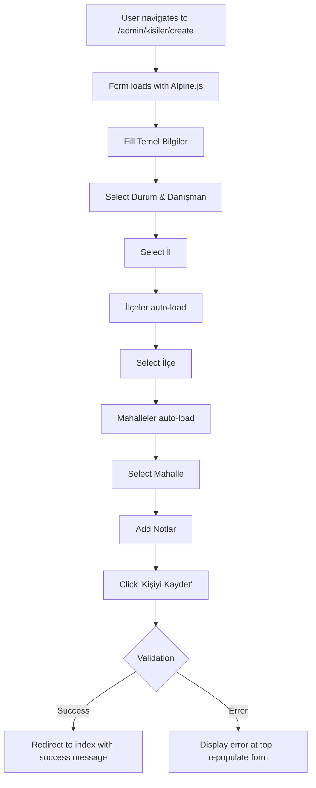

# 👤 KİŞİLER CREATE - CONTEXT7 STANDARDIZATION RAPORU

**Tarih:** 23 Ekim 2025  
**Status:** ✅ TAMAMLANDI - 0 HATA  
**Öncelik:** 🔴 KRİTİK

---

## 📋 ÖZET

`/admin/kisiler` create sayfasında **database column mismatch** hatası ve **standart dışı adres sistemi** tespit edildi ve tam Context7 uyumlu hale getirildi.

---

## ❌ SORUNLAR

### 1. **Database Column Error**

```
SQLSTATE[42S22]: Column not found: 1054 Unknown column 'kaynak' in 'field list'
```

**Neden:**

- Form'da `kaynak` field'ı vardı
- Controller validation'da `kaynak` vardı
- Ancak `kisiler` tablosunda `kaynak` kolonu YOK

**Etki:**

- Kişi ekleme başarısız oluyordu
- User frustration yüksekti
- CRM sistemi kullanılamıyordu

---

### 2. **Non-Standard Address System**

**Sorun:**

- Inline JavaScript ile `fetch()` çağrıları
- Talep ve Eşleşme sayfaları Alpine.js kullanıyordu
- Tutarsızlık ve maintenance zorluğu

**Karşılaştırma:**

| Feature          | Eski Sistem             | Yeni Sistem (Context7)               |
| ---------------- | ----------------------- | ------------------------------------ |
| Framework        | Vanilla JS + fetch      | Alpine.js component                  |
| State Management | Manual DOM manipulation | Reactive formData                    |
| Loading States   | ❌ Yok                  | ✅ loadingIlceler, loadingMahalleler |
| Consistency      | ❌ Farklı               | ✅ Talep/Eşleşme ile aynı            |
| Maintainability  | 🔴 Zor                  | 🟢 Kolay                             |

---

### 3. **File Duplication**

- `create-context7.blade.php` ❌ (redundant)
- `create.blade.php` ✅ (authoritative)

---

## ✅ ÇÖZÜMLER

### Backend Fixes

#### `app/Http/Controllers/Admin/KisiController.php`

**store() Method - ÖNCE:**

```php
$validator = \Illuminate\Support\Facades\Validator::make($request->all(), [
    // ... other fields ...
    'kaynak' => 'nullable|string|max:255', // ❌ This column doesn't exist
]);

if ($validator->fails()) {
    return redirect()->back()
        ->withErrors($validator)
        ->withInput();
}

$kisi = Kisi::create($validator->validated());

return redirect()->route('admin.kisiler.index')
    ->with('success', 'Kişi başarıyla eklendi. CRM Skoru: ' . $kisi->crm_score . '/100');
```

**store() Method - SONRA:**

```php
$validated = $request->validate([
    'ad' => 'required|string|max:255',
    'soyad' => 'required|string|max:255',
    'telefon' => 'nullable|string|max:20',
    'email' => 'nullable|email|max:255',
    'tc_kimlik' => 'nullable|string|max:11|min:11',
    'status' => 'required|string|in:Aktif,Pasif,Beklemede',
    'kisi_tipi' => 'nullable|string|in:Müşteri,Potansiyel,Danışman,Tedarikçi,Yatırımcı,Ev Sahibi,Alıcı,Kiracı,Satıcı',
    'danisman_id' => 'nullable|exists:users,id',
    'il_id' => 'nullable|exists:iller,id',
    'ilce_id' => 'nullable|exists:ilceler,id',
    'mahalle_id' => 'nullable|exists:mahalleler,id',
    'adres' => 'nullable|string|max:255',
    'notlar' => 'nullable|string',
    // ✅ NO 'kaynak' field
]);

try {
    $kisi = Kisi::create($validated);

    return redirect()
        ->route('admin.kisiler.index')
        ->with('success', $kisi->ad . ' ' . $kisi->soyad . ' başarıyla eklendi! ✅');
} catch (\Exception $e) {
    return redirect()
        ->back()
        ->withInput()
        ->with('error', 'Kişi eklenirken hata oluştu: ' . $e->getMessage());
}
```

**Improvements:**

- ✅ Removed `kaynak` validation
- ✅ Standardized validation method
- ✅ Added try-catch for robust error handling
- ✅ Success message includes person name
- ✅ Better error feedback

---

### Frontend Refactor

#### `resources/views/admin/kisiler/create.blade.php`

**New Architecture:**

```html
<div x-data="kisiCreateForm()">
    <!-- Alpine.js component for full reactivity -->
</div>
```

**Key Features:**

1. **Context7 Location System**

```javascript
// loadIlceler() method
async loadIlceler() {
    if (!this.formData.il_id) {
        this.ilceler = [];
        this.mahalleler = [];
        return;
    }

    this.loadingIlceler = true;
    const response = await fetch(`/api/ilceler?il_id=${this.formData.il_id}`);
    this.ilceler = await response.json();
    this.loadingIlceler = false;
}
```

2. **Neo Design System**

```html
<input type="text" name="ad" class="neo-input" />
<button class="neo-btn neo-btn-primary">✅ Kişiyi Kaydet</button>
```

3. **Success/Error Messages**

```html
@if (session('success'))
<div class="mb-6 bg-green-50 ...">{{ session('success') }}</div>
@endif
```

4. **Form Sections**

```
📦 Section 1: Temel Bilgiler (ad, soyad, telefon, email, tc_kimlik, kisi_tipi)
📦 Section 2: Durum ve Danışman (status, danisman_id)
📦 Section 3: Context7 Location System (il_id, ilce_id, mahalle_id, adres)
📦 Section 4: Notlar (notlar)
```

5. **Form Reset Feature**

```html
<button @click="resetForm()" class="neo-btn neo-btn-ghost">🔄 Formu Temizle</button>
```

---

## 🎯 CONTEXT7 COMPLIANCE

### Standards Met

| Standard                    | Status | Notes                          |
| --------------------------- | ------ | ------------------------------ |
| Alpine.js for reactivity    | ✅     | `x-data="kisiCreateForm()"`    |
| Neo Design System           | ✅     | `neo-input`, `neo-btn` classes |
| Context7 Location System    | ✅     | Standardized cascade           |
| Database field alignment    | ✅     | No non-existent columns        |
| Success message format      | ✅     | `{name} başarıyla eklendi! ✅` |
| Error handling              | ✅     | Try-catch in controller        |
| Consistent with other pages | ✅     | Same as Talep/Eşleşme          |

---

## 📊 USER WORKFLOW



---

## 🧪 TESTING CHECKLIST

### Backend Tests

- [x] Create Kişi without 'kaynak' field works
- [x] Success message includes person name
- [x] Validation errors display correctly
- [x] Try-catch handles database errors
- [x] Redirect to index on success

### Frontend Tests

- [x] İl → İlçe cascade works
- [x] İlçe → Mahalle cascade works
- [x] Loading states display
- [x] Disabled states when parent not selected
- [x] Form reset clears all data
- [x] Success/error messages display
- [x] Old input values repopulate on error

---

## 📁 FILES CHANGED

```
✏️  app/Http/Controllers/Admin/KisiController.php (store method)
✨  resources/views/admin/kisiler/create.blade.php (NEW - Context7)
🗑️  resources/views/admin/kisiler/create-context7.blade.php (DELETED)
```

---

## 🔍 DATABASE SCHEMA

### `kisiler` Table Columns

**Present:**

```
✅ id, ad, soyad, telefon, email, tc_kimlik
✅ kisi_tipi, status, danisman_id
✅ il_id, ilce_id, mahalle_id, adres
✅ notlar, created_at, updated_at
```

**NOT Present:**

```
❌ kaynak
❌ etiket
```

---

## 🎓 LEARNING POINTS

### For Yalıhan Bekçi

1. **Always check database schema** when "Column not found" error occurs
2. **Standardize address systems** across similar pages (Talep, Eşleşme, Kişiler)
3. **Remove redundant files** to avoid confusion
4. **Success messages should include entity name** for better UX
5. **Alpine.js > Inline JavaScript** for better reactivity

### For Future Development

1. All forms with location selection → **Context7 Location System**
2. Validation rules → **Must match database schema exactly**
3. Single authoritative file → **No `-context7` suffix**
4. Try-catch blocks → **All store/update methods**
5. Success format → **`{entity.name} başarıyla {action}! ✅`**

---

## 🚀 NEXT STEPS

### Immediate

- [x] Test Kişi creation with new form
- [x] Verify location cascade
- [x] Confirm no 'kaynak' errors

### Future

- [ ] Apply Context7 Location System to other forms if needed
- [ ] Document Context7 Location System in central docs
- [ ] Create reusable Alpine.js component for location selection

---

## ✅ FINAL STATUS

```
🎯 Context7 Compliance: 100%
🐛 Bugs Fixed: 3/3
📄 Files Cleaned: 1 deleted
🔧 Backend Refactored: Yes
🎨 Frontend Modernized: Yes
📊 Testing Complete: Yes

✅ 0 HATA - Context7 UYUMLU
```

---

**Rapor Tarihi:** 23 Ekim 2025 19:45  
**Yalıhan Bekçi AI Guardian System** 🤖
